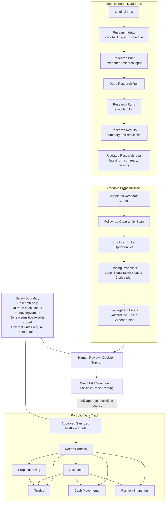

# Personal Investment Assistant Workspace

This repository is a Cursor workspace for personal investment research, planning, and assistant workflows.

It is not a coding workspace. The assistant should avoid adding code, scripts, applications, notebooks, or software project scaffolding unless a workflow explicitly requires it (for example Pine Screener scripts under `data/tradingview/`). If other code is genuinely required, the assistant must explain why, describe the files that would be created or changed, and ask for confirmation twice before proceeding.

## Purpose

This workspace is for:

- Investment research and analysis support
- Research idea intake, scheduling, and execution tracking
- Structured tradable ticker proposal research
- TradingView watchlist export and Pine Screener price-plan workflows
- Portfolio review support
- Notion portfolio and trading history schema planning
- Market and product research
- Safe integration with external services through CLI tools and direct API calls
- Reusable assistant workflows through Agent Skills

This workspace is not for:

- Placing trades
- Moving money
- Storing credentials or account secrets
- Storing raw financial statements, tax files, or brokerage exports
- Producing financial, legal, or tax advice
- Building software projects or storing code by default

## Language And Scope

Default communication language is Hong Kong Traditional Chinese unless otherwise requested.

Weekend/weekday rhythm:

- **Weekend (Research Mode):** generate ideas, run research, identify opportunities, and formulate plans.
- **Weekday (Execution Mode):** prioritize execution, adjustments, and risk/trigger monitoring based on existing plans.

Covered product types:

- Equities
- Derivatives
- ETFs
- Crypto assets

Covered markets:

- Hong Kong
- Japan
- United States

## High-Level Data Flow

The workspace separates research workflow data from portfolio and trading history data. Research outputs may support human review and monitoring, but they do not directly execute trades or move money.

## Tradable Proposal Layers

Trading proposals follow a two-layer model documented in [`data/notion/research.md`](data/notion/research.md) (Trading Proposals section):

| Layer | What | Where |
| --- | --- | --- |
| Layer 1 | Qualitative hypothesis from research import | `Trading Proposals` |
| Layer 2 | Alpha Vantage last close + external entry/stop/target prices and derived reward/risk | `Trading Proposals` price-plan fields |

Handoffs:

1. Research follow-up imports Layer 1 fields (`followup-tradable-tickers`).
2. Alpha Vantage last close populates `Last Price` and `Quote As Of` (`refresh-proposal-quotes`).
3. Pine Screener scripts, manual review, or other external processes populate `Entry Price`, `Stop Price`, `Target Price`, and derived `Reward Risk Ratio`, then set `Pricing Status = Ready`.

Layer 2 uses Alpha Vantage for `Last Price` only. Portfolio sizing and execution history are defined separately. No automated order placement.

## Workspace Structure

- `AGENTS.md`: Instructions for Cursor Agent behavior, safety boundaries, language preference, and workspace rules.
- `data/`: Sanitized examples, schemas, derived summaries, or pointers to approved external data sources.
  - `data/notion/`: Notion database specs (`research.md`, `portfolio.md`)
  - `data/parallel/`: Parallel Task API output contracts and paired prompts
  - `data/prompts/`: Reusable prompt assets
  - `data/tradingview/`: TradingView watchlist exports and Pine Screener scripts
- `.agents/skills/`: Project-level Agent Skills for repeatable assistant workflows.
- `.cursor/rules/`: Cursor project rules for safety and research workflows.
- `.cursor/mcp.json`: Project-level MCP configuration. It currently contains no live services or credentials.
- `.cursorignore`: Excludes sensitive or bulky files from Cursor context and indexing.
- `env.sample`: Non-secret template for local API keys and service names. Copy to `.env` locally.

## Agent Skills

Project skills live under `.agents/skills/`. Prefer skills and CLI tools over MCP unless explicitly requested.

| Skill | Purpose |
| --- | --- |
| `alphavantage-curl` | Alpha Vantage quotes and time series via `curl` |
| `notion-api` | Notion REST API operations |
| `parallel-deep-research` | Parallel deep research runs |
| `expand-new-ideas` | Expand `Research Ideas` from `Original Idea` to `Research Input` |
| `run-expanded-ideas-deep-research` | Start deep research for eligible expanded ideas |
| `poll-deep-research-runs` | Poll in-flight runs and sync summaries to Notion |
| `followup-tradable-tickers` | Parallel Task follow-up, validate ticker JSON, import `Trading Proposals` |
| `export-tv-watchlist` | Export watchlist locally and provision per-run Fast.io session with `watchlist.txt` |
| `create-tv-pine-screener` | Author Pine Screener scripts for Layer 2 price fields |
| `fastio-cli` | Fast.io file ops; per-run sessions store `watchlist.txt` and `screener-*.csv` |
| `refresh-proposal-quotes` | Refresh `Last Price` and `Quote As Of` on `Trading Proposals` |
| `refresh-workspace` | Read-only workspace context refresh |

Tooling priority: **CLI > direct API via `curl` > MCP** (fallback).

## Authentication

Copy `env.sample` to `.env` locally. Supported variables:

- `ALPHAVANTAGE_API_KEY`, `NOTION_API_TOKEN`, `PARALLEL_API_KEY`
- `FASTIO_API_KEY`, `FASTIO_WORKSPACE_NAME`

Never commit `.env` or store secrets in tracked files.

## Data Policy

Keep sensitive financial data outside this workspace by default.

Do not store credentials, API keys, access tokens, seed phrases, account numbers, tax identifiers, identity documents, full statements, raw exports, or tax forms.

Before saving any data into the workspace, the assistant should summarize what will be saved, where it will be saved, and whether it may contain sensitive financial or personal information.

## Notion Portfolio Schema Plan

Portfolio and trading history live in Notion. The first version should stay small and avoid a separate instruments database.

The saved schema is available at `data/notion/portfolio.md` for later reference before applying changes to Notion. That document is **provisional**; the canonical `Trading Proposals` schema is in [`data/notion/research.md`](data/notion/research.md).

Recommended starting databases:

- `Accounts`: broker or exchange accounts, with a display name, provider, and base currency.
- `Trades`: executed buys and sells, storing symbol, market, asset type, side, quantity, price, currency, fees, taxes, timestamps, source, and external import ID.
- `Cash Movements`: deposits, withdrawals, dividends, interest, fees, taxes, and adjustments, with currency, amount, type, timestamps, source, and optional related trade.
- `Position Snapshots`: periodic position snapshots for reconciliation against broker or API data, including quantity, average cost, market price, and market value.
- `Proposal Sizing`: sized quantity and notional after combining an accepted trading proposal with portfolio state.

Implementation notes:

- Use Notion `number` for quantities and money values.
- Use Notion `date` for trade and cash movement timestamps.
- Use Notion relations for cross-database links such as trades to accounts, proposal sizing, and trading proposals.
- Keep `source` and `external_id` fields for import deduplication.
- Do not store credentials, account numbers, raw exports, tax documents, or full statements.
- Make Notion portfolio database structure changes only after explicit confirmation.

## Safety

The assistant must not place trades, move money, submit forms, open accounts, close accounts, change beneficiaries, or take irreversible financial actions.

All outputs should be treated as research and analysis support, not financial advice.