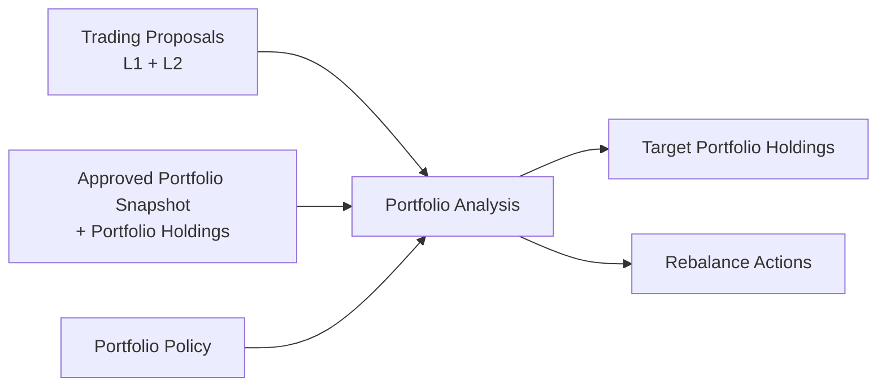

# Notion Portfolio Database Schema v2

Snapshot date: 2026-06-07

This document defines the Notion database schema for **portfolio planning**. It supports daily portfolio state capture and **Portfolio Analysis** outputs (Layer 3: `Portfolio Analysis`, `Target Portfolio Holdings`, `Rebalance Actions`).

It does **not** define trade execution logging, cash event ledgers, or P&L accounting trails.

Related:

- [`data/notion/research.md`](research.md) — `Trading Proposals` (Layer 1 + Layer 2 price plan)
- [`../portfolio/guardrails.md`](../portfolio/guardrails.md) — `Portfolio Policy` and analysis guardrails

## Scope

### In scope

- Daily (or periodic) portfolio state via `Portfolio Snapshot` and `Portfolio Holdings`
- **Portfolio Analysis** → **Target Portfolio Holdings** + **Rebalance Actions** (Layer 3; workflow ends at these outputs)

### Out of scope

- Multi-broker or sub-portfolio attribution (single portfolio only)
- Executed buy/sell records, fees, taxes, settlement, or broker fill import
- Deposit, withdrawal, dividend, or fee event ledgers
- Trade-ledger-derived open positions
- Realized / unrealized P&L and performance attribution trails
- Trade-ledger-derived average cost history (`Portfolio Holdings` may store point-in-time `Average Cost` from broker capture only)
- Tracking whether rebalance actions were executed (inferred only when a later `Portfolio Snapshot` is submitted)
- Automated order placement or post-trade reconciliation against fills
- Board-lot rounding for order submission (HK/JP lot constraints)

### Excluded from this document

- Page IDs, database IDs, data source IDs, property IDs, URLs, commands, prompts, raw rows
- Raw brokerage exports, full statements, tax documents, credentials, account secrets

## Design Notes

- **Single portfolio:** no multi-broker or sub-portfolio attribution.
- **Approved Portfolio Snapshot:** a `Portfolio Snapshot` row with `Status` = `approved`. The planner uses the latest by `Snapshot Date`.
- Target storage: Notion databases.
- Use Notion `number` for quantities, prices, and money values.
- Use Notion `date` for snapshot as-of dates and analysis timestamps.
- Store `ticker`, `market`, `asset_class`, and `currency` on `Portfolio Holdings`.
- **Planned prices** (entry, stop, target) on holdings support risk-at-stop; canonical plan for new ideas remains on `Trading Proposals`.
- **`Average Cost`** on a holding is actual cost at capture time (broker/manual), not a computed ledger.
- **Layer 3 deliverables:** `Portfolio Analysis` produces `Target Portfolio Holdings` and `Rebalance Actions`. The workspace workflow **ends** there.
- **Portfolio ground truth** is the latest **Approved Portfolio Snapshot** and its `Portfolio Holdings`, not a derived trade ledger.
- **Portfolio heat** and exposure aggregates are computed by the analyzer at run time; not stored on `Portfolio Snapshot`.
- Do not store credentials, API keys, full account numbers, raw brokerage exports, tax documents, or full statements.
- Do not apply Notion portfolio database structure changes without summarizing intended changes and receiving explicit confirmation.

## Portfolio Snapshot

Purpose: **one portfolio state as of a `Snapshot Date`**. One row per snapshot date. When `Status` = `approved`, this row is an **Approved Portfolio Snapshot** and may be used as input to **Portfolio Analysis**.

There is no separate trade or cash-movement ledger. A new portfolio state is captured by creating a new `Portfolio Snapshot` for a given date.

### Properties

| Property | Type | Notes |
| --- | --- | --- |
| `Snapshot` | title | Human-readable label, typically `Portfolio YYYY-MM-DD`. |
| `Snapshot Date` | date | As-of date (date only). |
| `Status` | select | `draft`, `approved`, `superseded`. Latest `approved` = input to analysis. |
| `Base Currency` | select | `HKD`, `USD`, `JPY`, `CNY`, `OTHER`. Align with [`guardrails.yaml`](../portfolio/guardrails.yaml). |
| `Captured At` | date | When recorded (datetime optional). |
| `Portfolio NAV` | number | Sum of holdings `Market Value`; rollup or manual check. |
| `Cash Available` | number | CASH holding `Market Value`. |
| `Holdings Count` | number | Non-cash holdings count; optional rollup. |
| `Source` | rich_text | e.g. `manual`, `broker_export`, `api`. |
| `Notes` | rich_text | Optional notes. |

### Portfolio Snapshot Relations

- `Portfolio Holdings` → holding rows (relation on holdings)

### Derived values (analyzer; not stored)

- **Portfolio heat pct:** Σ holding risk-at-stop ÷ NAV (see **Portfolio Holdings**).
- **Market exposure pct:** sum of weights by `Market`.
- **Latest Approved Portfolio Snapshot:** max `Snapshot Date` where `Status` = `approved`.

## Portfolio Holdings

Purpose: **one row per holding or cash** within a `Portfolio Snapshot`. Input for **Portfolio Analysis** and risk-at-stop.

### Row model

- **Holdings:** one row per `(Portfolio Snapshot, Ticker)` with `Holding Type` = `holding`.
- **Cash:** one row per snapshot with `Holding Type` = `cash`, `Ticker` = `CASH`.
- **Short support:** `Trade Type` = `short`; risk-at-stop uses stop above entry.

### Identity and quantity

| Property | Type | Notes |
| --- | --- | --- |
| `Holding` | title | Ticker only (e.g. `NVDA`, `0700`) or `CASH`. Snapshot context comes from `Portfolio Snapshot` relation and `Snapshot Date` rollup. |
| `Portfolio Snapshot` | relation | → `Portfolio Snapshot`. |
| `Snapshot Date` | rollup | Roll up `Portfolio Snapshot.Snapshot Date`. |
| `Holding Type` | select | `holding`, `cash`. |
| `Ticker` | rich_text | Aligns with `Trading Proposals.Ticker`. Cash: `CASH`. |
| `Company Name` | rich_text | Optional. |
| `Market` | select | `HK`, `JP`, `US`, `OTHER`. |
| `Asset Class` | select | `equity`, `etf`, `bond`, `future`, `option`, `crypto`, `cash`, `other`. |
| `Currency` | select | Quote or reporting currency. |
| `Trade Type` | select | `long`, `short`, `n/a`. Cash: `n/a`. |
| `Quantity` | number | Units held. Cash: balance. |
| `Market Price` | number | Mark price. Empty for cash. |
| `Market Value` | number | Holdings: `Quantity × Market Price`. Cash: = `Quantity`. |

### Planned vs actual prices

| Property | Type | Notes |
| --- | --- | --- |
| `Entry Price` | number | **Planned** entry / reference (from proposal or manual). |
| `Average Cost` | number | **Actual** cost at capture. Optional. Not a ledger. |
| `Stop Price` | number | Planned stop for risk-at-stop. |
| `Target Price` | number | Planned target. |

### Thesis and provenance

| Property | Type | Notes |
| --- | --- | --- |
| `Source Proposal` | relation | Optional → `Trading Proposals`. |
| `Rationale` | rich_text | Why held; from proposal or manual. |
| `Invalidation` | rich_text | Optional thesis-break summary. |
| `Pricing As Of` | date | Optional; for `Market Price`. |
| `Holding Source` | rich_text | Optional if snapshot `Source` is insufficient. |
| `Notes` | rich_text | Optional. |

### Portfolio Holdings Relations

- `Portfolio Holdings.Portfolio Snapshot` → `Portfolio Snapshot`
- `Portfolio Holdings.Source Proposal` → `Trading Proposals` (optional)

### Derived values (analyzer; not stored)

| Derived | Rule |
| --- | --- |
| **Weight pct** | `Market Value` ÷ snapshot NAV × 100 |
| **Risk at stop** | `long`: `Quantity × max(0, Entry − Stop)`; `short`: `Quantity × max(0, Stop − Entry)` |
| **Risk at stop pct** | risk at stop ÷ NAV × 100 |
| **Portfolio heat pct** | Σ risk at stop ÷ NAV × 100 |

Use `Entry Price` and `Stop Price` for portfolio heat. `Average Cost` is informational unless a future workflow uses it explicitly.

## Layer 3 — Portfolio Analysis

Purpose: **one portfolio planning run**. Each row records inputs, policy audit, aggregate target metrics, and human-readable summary. Child rows in **Target Portfolio Holdings** and **Rebalance Actions** link back via `Portfolio Analysis` relation.

**Workflow ends** when this run produces linked target holdings and rebalance actions. No execution tracking.

### Ground Rules

- **In scope:** planning outputs only — target weights, suggested deltas, rejection reasons.
- **Out of scope:** order status, fill prices, partial execution, broker tickets.
- **Single portfolio:** one Approved Portfolio Snapshot per analysis (user may override date in a future skill).
- **Policy audit:** copy effective limit snapshots onto the analysis row for reproducibility (see [`../portfolio/guardrails.md`](../portfolio/guardrails.md)).
- **Currency:** `Target Market Value`, `Delta Market Value`, and risk fields on child rows are in the analysis **base currency** (from linked snapshot / policy).

### Properties

**Property count:** 32

#### Identity

| Property | Type | Notes |
| --- | --- | --- |
| `Analysis` | title | Human-readable label, typically `Analysis YYYY-MM-DD`. |
| `Analysis Date` | date | When the analysis was run (date only). |
| `Status` | select | `draft`, `completed`, `infeasible`, `failed`. |
| `Computed At` | date | Timestamp when planner finished (datetime optional). |

#### Input Links

| Property | Type | Notes |
| --- | --- | --- |
| `Portfolio Snapshot` | relation | → `Portfolio Snapshot` used as input (expected `Status` = `approved`). |
| `Snapshot Date` | rollup | Roll up `Portfolio Snapshot.Snapshot Date`. Function: `show_original`. |
| `Portfolio Policy` | relation | → `Portfolio Policy` row used for this run. |
| `Policy Effective Date` | rollup | Roll up `Portfolio Policy.Effective Date`. Function: `show_original`. |

#### Input Metrics (at run time)

| Property | Type | Notes |
| --- | --- | --- |
| `Base Currency` | select | `HKD`, `USD`, `JPY`, `CNY`, `OTHER`. From snapshot / policy. |
| `Input NAV` | number | Snapshot NAV at analysis time. |
| `Input Cash Pct` | number | Cash weight before planning (%). |
| `Input Portfolio Heat Pct` | number | Portfolio heat before planning (%). |
| `Input Holdings Count` | number | Non-cash positions before planning. |
| `Candidate Proposals Count` | number | Proposals considered before filters. |
| `Eligible Proposals Count` | number | Proposals passing policy filters. |

#### Policy Audit (effective limits used)

| Property | Type | Notes |
| --- | --- | --- |
| `Max Portfolio Heat Pct` | number | Effective heat cap applied (%). |
| `Max Single Holding Pct` | number | Effective single-name cap (%). |
| `Min Cash Pct` | number | Effective minimum cash (%). |
| `Max Turnover Pct` | number | Effective turnover cap (%). |
| `Objective` | select | `maximize_conviction_weighted_reward_risk`, `minimize_turnover`, `maximize_new_proposals`. Copied from policy. |
| `Sizing Method` | select | `risk_at_stop` (v1). Copied from policy. |
| `Drawdown Triggered` | checkbox | True when drawdown regime overrides were applied. |
| `Regime Notes` | rich_text | Optional; documents overrides (drawdown, stale pricing, etc.). |

#### Target Aggregates (after planning)

| Property | Type | Notes |
| --- | --- | --- |
| `Target NAV` | number | Planned NAV (typically equals `Input NAV`). |
| `Target Cash Pct` | number | Planned cash weight (%). |
| `Target Portfolio Heat Pct` | number | Planned portfolio heat (%). |
| `Target Holdings Count` | number | Planned non-cash positions. |
| `Turnover Pct` | number | Sum of \|delta MV\| ÷ NAV × 100 for non-hold actions. |
| `Rebalance Actions Count` | number | Count of linked rebalance rows (excluding pure `hold`). |

#### Summary

| Property | Type | Notes |
| --- | --- | --- |
| `Executive Summary` | rich_text | Human-readable conclusion: key changes, risks, guardrail status. |
| `Rejection Summary` | rich_text | Proposals rejected and primary reasons (heat, concentration, R/R, etc.). |
| `Infeasibility Reason` | rich_text | Required when `Status` = `infeasible`. |
| `Error Message` | rich_text | Required when `Status` = `failed`. |
| `Notes` | rich_text | Optional user or planner notes. |

### Portfolio Analysis Relations

- `Portfolio Analysis.Portfolio Snapshot` → `Portfolio Snapshot`
- `Portfolio Analysis.Portfolio Policy` → `Portfolio Policy`
- `Target Portfolio Holdings.Portfolio Analysis` → `Portfolio Analysis` (inverse)
- `Rebalance Actions.Portfolio Analysis` → `Portfolio Analysis` (inverse)

---

## Layer 3 — Target Portfolio Holdings

Purpose: **one row per planned line** (ticker or cash) in the target portfolio for a single **Portfolio Analysis** run. Includes incumbents kept, trimmed, proposals added, and the cash line.

### Row Model

- **Holdings:** one row per `(Portfolio Analysis, Ticker)` with `Holding Type` = `holding`.
- **Cash:** one row per analysis with `Holding Type` = `cash`, `Ticker` = `CASH`.
- **Merged incumbents:** when a snapshot holding matches an eligible proposal, one target row with `Line Source` = `merged`.

### Properties

**Property count:** 24

#### Identity

| Property | Type | Notes |
| --- | --- | --- |
| `Holding` | title | Ticker only (e.g. `NVDA`, `0700`) or `CASH`. |
| `Portfolio Analysis` | relation | → `Portfolio Analysis`. |
| `Analysis Date` | rollup | Roll up `Portfolio Analysis.Analysis Date`. Function: `show_original`. |
| `Ticker` | rich_text | Aligns with `Trading Proposals.Ticker`. Cash: `CASH`. |
| `Company Name` | rich_text | Optional. |
| `Holding Type` | select | `holding`, `cash`. |
| `Market` | select | `HK`, `JP`, `US`, `OTHER`. |
| `Asset Class` | select | `equity`, `etf`, `bond`, `future`, `option`, `crypto`, `cash`, `other`. |
| `Currency` | select | Quote currency for quantity / local prices. |
| `Trade Type` | select | `long`, `short`, `n/a`. Cash: `n/a`. |

#### Target Allocation

| Property | Type | Notes |
| --- | --- | --- |
| `Target Weight Pct` | number | Planned weight ÷ `Target NAV` × 100. |
| `Target Market Value` | number | Planned MV in analysis base currency. |
| `Target Quantity` | number | Planned units. Cash: = cash balance in base currency. |
| `Entry Price` | number | Planned entry / reference (from proposal or incumbent). |
| `Stop Price` | number | Planned stop for risk-at-stop. |
| `Target Price` | number | Planned take-profit. |

#### Risk (planned)

| Property | Type | Notes |
| --- | --- | --- |
| `Risk at Stop` | number | Planned risk at stop in **base currency**. |
| `Risk at Stop Pct` | number | `Risk at Stop` ÷ `Target NAV` × 100. |

Same formulas as **Portfolio Holdings** derived values; computed at plan time.

#### Provenance

| Property | Type | Notes |
| --- | --- | --- |
| `Line Source` | select | `incumbent`, `proposal`, `merged`, `cash`. |
| `Source Proposal` | relation | Optional → `Trading Proposals`. |
| `Source Holding` | relation | Optional → input `Portfolio Holdings` row (incumbent / merged). |
| `Action Hint` | select | Planner hint: `hold`, `increase`, `decrease`, `add`, `remove`. Mirrors rebalance intent; not execution status. |
| `Notes` | rich_text | Optional line-level notes. |

### Target Portfolio Holdings Relations

- `Target Portfolio Holdings.Portfolio Analysis` → `Portfolio Analysis`
- `Target Portfolio Holdings.Source Proposal` → `Trading Proposals` (optional)
- `Target Portfolio Holdings.Source Holding` → `Portfolio Holdings` (optional)

---

## Layer 3 — Rebalance Actions

Purpose: **suggested adjustments** from input snapshot holdings → target portfolio for one **Portfolio Analysis** run. Each row is a human-review action item, not a trade ledger entry.

### Row Model

- Typically **one row per ticker** with a non-zero delta (including new adds and full exits).
- Pure `hold` lines with zero delta may be omitted or included with `Action Type` = `hold` (planner default: **omit** zero-delta holds to reduce noise).
- Cash adjustments appear as `Ticker` = `CASH` when target cash differs from input.

### Properties

**Property count:** 22

#### Identity

| Property | Type | Notes |
| --- | --- | --- |
| `Rebalance Action` | title | Human-readable label, typically `<Ticker> <Action Type>`. |
| `Portfolio Analysis` | relation | → `Portfolio Analysis`. |
| `Analysis Date` | rollup | Roll up `Portfolio Analysis.Analysis Date`. Function: `show_original`. |
| `Ticker` | rich_text | Aligns with target / snapshot ticker. Cash: `CASH`. |
| `Market` | select | `HK`, `JP`, `US`, `OTHER`. |
| `Currency` | select | Quote currency for quantity deltas. |

#### Action

| Property | Type | Notes |
| --- | --- | --- |
| `Action Type` | select | `buy`, `sell`, `trim`, `add`, `close`, `hold`. See **Action Type rules** below. |
| `Priority` | select | `high`, `medium`, `low`. |
| `Sequence` | number | Optional sort order within the analysis (1 = first). |

#### Current vs Target

All **market values in base currency** (analysis `Base Currency`).

| Property | Type | Notes |
| --- | --- | --- |
| `Current Market Value` | number | Input snapshot MV for this line (0 if new add). |
| `Target Market Value` | number | Planned target MV. |
| `Delta Market Value` | number | `Target Market Value − Current Market Value` (positive = increase). |
| `Current Quantity` | number | Input snapshot quantity (0 if new add). |
| `Target Quantity` | number | Planned quantity. |
| `Delta Quantity` | number | `Target Quantity − Current Quantity`. |

#### Reference Prices (framing only)

| Property | Type | Notes |
| --- | --- | --- |
| `Reference Price` | number | Price used for MV / qty conversion (e.g. `Last Price` or `Entry Price`). |
| `Entry Price` | number | Planned entry from target line. |
| `Stop Price` | number | Planned stop from target line. |

#### Context

| Property | Type | Notes |
| --- | --- | --- |
| `Rationale` | rich_text | Why this action (thesis, guardrail trim, new proposal, etc.). |
| `Constraint Notes` | rich_text | Optional; e.g. `heat limit`, `max single holding`, `turnover cap`. |
| `Source Proposal` | relation | Optional → `Trading Proposals`. |
| `Related Holding` | relation | Optional → input `Portfolio Holdings`. |
| `Notes` | rich_text | Optional. |

### Action Type Rules

| Condition | `Action Type` |
| --- | --- |
| No incumbent; target qty > 0 | `add` |
| Incumbent; target qty = 0 | `close` |
| Incumbent; delta MV < 0 (partial) | `trim` |
| Incumbent; delta MV > 0 | `buy` (increase existing) |
| New line via sell / short increase | `sell` when reducing long or opening/increasing short (planner uses `sell` for MV decrease on existing long) |
| delta MV = 0 | `hold` (usually omitted from output) |

Planner may simplify: use `trim` for any incumbent decrease and `add` for any increase on a new ticker; reserve `buy` for increasing an existing line.

### Rebalance Actions Relations

- `Rebalance Actions.Portfolio Analysis` → `Portfolio Analysis`
- `Rebalance Actions.Source Proposal` → `Trading Proposals` (optional)
- `Rebalance Actions.Related Holding` → `Portfolio Holdings` (optional)

---

## Layer 3 — Cross-Database Notes

### Inputs (planner)

- Latest **Approved Portfolio Snapshot** and its **Portfolio Holdings** (or user-selected snapshot date)
- Eligible `Trading Proposals` per active **Portfolio Policy** filters
- Active **Portfolio Policy**

### Outputs

| Database | Purpose |
| --- | --- |
| **Portfolio Analysis** | One analysis: inputs, policy audit, aggregates, summary |
| **Target Portfolio Holdings** | Full target portfolio (all tickers + cash + weights) |
| **Rebalance Actions** | Suggested adjustments current → target |

Whether rebalance actions are executed is **not tracked**. A later `Portfolio Snapshot` on a new date reflects actual state if captured manually.

See guardrail evaluation order in [`../portfolio/guardrails.md`](../portfolio/guardrails.md).

### Derived Values (planner; stored on analysis / child rows)

| Derived | Where stored |
| --- | --- |
| Turnover pct | `Portfolio Analysis.Turnover Pct` |
| Target portfolio heat | `Portfolio Analysis.Target Portfolio Heat Pct` |
| Per-line weight / risk | `Target Portfolio Holdings` |
| Delta MV / qty | `Rebalance Actions` |


## Cross-Database Flow

Canonical proposal schema: [`research.md`](research.md) (Trading Proposals).

1. Research follow-up imports Layer 1 into `Trading Proposals`.
2. Alpha Vantage updates `Last Price` and `Quote As Of`.
3. Pine Screener CSV populates Layer 2 prices and `Pricing Status = Ready` when applicable.
4. User captures `Portfolio Snapshot` + `Portfolio Holdings`; sets `Status` = `approved` when ready.
5. **Portfolio Analysis** reads Approved Portfolio Snapshot + eligible proposals + policy → **Target Portfolio Holdings** + **Rebalance Actions**.
6. **Workflow ends.** No execution logging. A future snapshot on a new date is a separate capture cycle, not a follow-up step to step 5.



## Reconstruction Order

Use this section to recreate all portfolio-planning Notion databases from scratch. Property names, types, and select options must match the schema sections above exactly.

### Before You Start

- Choose one **parent Notion page** for the portfolio workspace (for example a page named `Portfolio`). Create all databases below as **inline databases** on that page unless you prefer otherwise.
- **`Trading Proposals`** is an external dependency. Build it first using [`research.md`](research.md) **Reconstruction Order** before adding `Portfolio Holdings.Source Proposal` or Layer 3 proposal relations.
- **`Portfolio Policy`** property details live in [`../portfolio/guardrails.md`](../portfolio/guardrails.md). Follow that document’s **Reconstruction Order** for the policy database and initial row.
- For programmatic setup, use [`.agents/skills/notion-api/SKILL.md`](../../.agents/skills/notion-api/SKILL.md) (`POST /v1/databases` with `initial_data_source.properties`, Notion-Version `2025-09-03`). Map each step below to a property in the API payload or to an equivalent Notion UI action.
- This document intentionally excludes database IDs, data source IDs, and copy-paste API payloads. After creation, verify property names and select options against the tables above.

### Shared Select Options

Use these option sets wherever the schema references the same labels:

| Property context | Options |
| --- | --- |
| `Base Currency`, `Currency` | `HKD`, `USD`, `JPY`, `CNY`, `OTHER` |
| `Market` | `HK`, `JP`, `US`, `OTHER` |
| `Asset Class` | `equity`, `etf`, `bond`, `future`, `option`, `crypto`, `cash`, `other` |
| `Trade Type` | `long`, `short`, `n/a` |
| `Holding Type` | `holding`, `cash` |

---

### Portfolio Snapshot

1. Create an inline database named **`Portfolio Snapshot`** on the portfolio parent page.
2. Set the title property to **`Snapshot`**.
3. Add non-relation properties from the **Portfolio Snapshot** section above:
   - `Snapshot Date` (date)
   - `Status` (select): `draft`, `approved`, `superseded`
   - `Base Currency` (select): shared **Base Currency** options
   - `Captured At` (date)
   - `Portfolio NAV`, `Cash Available`, `Holdings Count` (number)
   - `Source`, `Notes` (rich_text)
4. Do **not** add a relation to `Portfolio Holdings` on this database. The relation is configured on the holdings side only.

---

### Portfolio Holdings

5. Create an inline database named **`Portfolio Holdings`** on the same parent page.
6. Set the title property to **`Holding`**.
7. Add non-relation properties from **Portfolio Holdings** above:
   - Identity / quantity: `Holding Type`, `Ticker`, `Company Name`, `Market`, `Asset Class`, `Currency`, `Trade Type`, `Quantity`, `Market Price`, `Market Value`
   - Planned vs actual: `Entry Price`, `Average Cost`, `Stop Price`, `Target Price`
   - Thesis / provenance: `Rationale`, `Invalidation`, `Pricing As Of`, `Holding Source`, `Notes`
8. Configure all select options using **Shared Select Options** and the **Portfolio Holdings** property table.
9. Add **`Portfolio Snapshot`** as a relation → **`Portfolio Snapshot`**.
10. Add **`Snapshot Date`** as a rollup:
    - Relation property: `Portfolio Snapshot`
    - Related property: `Snapshot Date`
    - Function: `show_original`
11. Add **`Source Proposal`** as a relation → **`Trading Proposals`** (optional link; requires `Trading Proposals` to exist).

---

### Portfolio Policy

12. Follow **Reconstruction Order** in [`../portfolio/guardrails.md`](../portfolio/guardrails.md):
    - Create **`Portfolio Policy`** with all properties listed there.
    - Insert an initial row from [`../portfolio/guardrails.yaml`](../portfolio/guardrails.yaml) when ready.
    - After review, set `Status` = `active`, `Active` = true, and `Effective Date`.

---

### Trading Proposals (external)

13. Ensure **`Trading Proposals`** exists per [`research.md`](research.md) **Reconstruction Order**. No additional portfolio-specific changes are required on that database.

---

### Portfolio Analysis (Layer 3)

Create this database **after** `Portfolio Snapshot` and `Portfolio Policy` exist.

14. Create an inline database named **`Portfolio Analysis`** on the portfolio parent page.
15. Set the title property to **`Analysis`**.
16. Add identity properties:
    - `Analysis Date`, `Computed At` (date)
    - `Status` (select): `draft`, `completed`, `infeasible`, `failed`
17. Add **`Portfolio Snapshot`** as a relation → **`Portfolio Snapshot`**.
18. Add **`Snapshot Date`** as a rollup:
    - Relation property: `Portfolio Snapshot`
    - Related property: `Snapshot Date`
    - Function: `show_original`
19. Add **`Portfolio Policy`** as a relation → **`Portfolio Policy`**.
20. Add **`Policy Effective Date`** as a rollup:
    - Relation property: `Portfolio Policy`
    - Related property: `Effective Date`
    - Function: `show_original`
21. Add input metric properties (number unless noted):
    - `Base Currency` (select): shared **Base Currency** options
    - `Input NAV`, `Input Cash Pct`, `Input Portfolio Heat Pct`, `Input Holdings Count`, `Candidate Proposals Count`, `Eligible Proposals Count`
22. Add policy audit properties:
    - `Max Portfolio Heat Pct`, `Max Single Holding Pct`, `Min Cash Pct`, `Max Turnover Pct` (number)
    - `Objective` (select): `maximize_conviction_weighted_reward_risk`, `minimize_turnover`, `maximize_new_proposals`
    - `Sizing Method` (select): `risk_at_stop`
    - `Drawdown Triggered` (checkbox)
    - `Regime Notes` (rich_text)
23. Add target aggregate properties (number):
    - `Target NAV`, `Target Cash Pct`, `Target Portfolio Heat Pct`, `Target Holdings Count`, `Turnover Pct`, `Rebalance Actions Count`
24. Add summary properties (rich_text unless noted):
    - `Executive Summary`, `Rejection Summary`, `Infeasibility Reason`, `Error Message`, `Notes`

---

### Target Portfolio Holdings (Layer 3)

Create this database **after** **`Portfolio Analysis`** exists.

25. Create an inline database named **`Target Portfolio Holdings`** on the portfolio parent page.
26. Set the title property to **`Holding`**.
27. Add non-relation identity properties:
    - `Ticker`, `Company Name`, `Holding Type`, `Market`, `Asset Class`, `Currency`, `Trade Type`
28. Add target allocation properties (number):
    - `Target Weight Pct`, `Target Market Value`, `Target Quantity`, `Entry Price`, `Stop Price`, `Target Price`
29. Add risk properties (number):
    - `Risk at Stop`, `Risk at Stop Pct`
30. Add provenance properties:
    - `Line Source` (select): `incumbent`, `proposal`, `merged`, `cash`
    - `Action Hint` (select): `hold`, `increase`, `decrease`, `add`, `remove`
    - `Notes` (rich_text)
31. Configure select options using **Shared Select Options** and the **Target Portfolio Holdings** property table.
32. Add **`Portfolio Analysis`** as a relation → **`Portfolio Analysis`**.
33. Add **`Analysis Date`** as a rollup:
    - Relation property: `Portfolio Analysis`
    - Related property: `Analysis Date`
    - Function: `show_original`
34. Add **`Source Proposal`** as a relation → **`Trading Proposals`** (optional).
35. Add **`Source Holding`** as a relation → **`Portfolio Holdings`** (optional).

---

### Rebalance Actions (Layer 3)

Create this database **after** **`Portfolio Analysis`** exists.

36. Create an inline database named **`Rebalance Actions`** on the portfolio parent page.
37. Set the title property to **`Rebalance Action`**.
38. Add non-relation properties:
    - `Ticker` (rich_text)
    - `Market` (select): shared **Market** options
    - `Currency` (select): shared **Base Currency** options
    - `Action Type` (select): `buy`, `sell`, `trim`, `add`, `close`, `hold`
    - `Priority` (select): `high`, `medium`, `low`
    - `Sequence` (number)
    - `Current Market Value`, `Target Market Value`, `Delta Market Value`, `Current Quantity`, `Target Quantity`, `Delta Quantity` (number)
    - `Reference Price`, `Entry Price`, `Stop Price` (number)
    - `Rationale`, `Constraint Notes`, `Notes` (rich_text)
39. Add **`Portfolio Analysis`** as a relation → **`Portfolio Analysis`**.
40. Add **`Analysis Date`** as a rollup:
    - Relation property: `Portfolio Analysis`
    - Related property: `Analysis Date`
    - Function: `show_original`
41. Add **`Source Proposal`** as a relation → **`Trading Proposals`** (optional).
42. Add **`Related Holding`** as a relation → **`Portfolio Holdings`** (optional).

---

### Verification Checklist

After all databases exist, confirm:

| Check | Expected |
| --- | --- |
| Database count | 6 portfolio databases: `Portfolio Snapshot`, `Portfolio Holdings`, `Portfolio Policy`, `Portfolio Analysis`, `Target Portfolio Holdings`, `Rebalance Actions` |
| External dependency | `Trading Proposals` reachable from holdings and Layer 3 proposal relations |
| Rollups | Three rollups on `Portfolio Holdings`; two on `Portfolio Analysis`; one each on `Target Portfolio Holdings` and `Rebalance Actions` |
| Policy row | At least one `Portfolio Policy` row with `Active` = true for planner / guardrail skills |
| Snapshot workflow | Can create a `Portfolio Snapshot`, link `Portfolio Holdings` rows, set `Status` = `approved` |
| Layer 3 linkage | Can create a `Portfolio Analysis` row linked to an approved snapshot and active policy; child target / rebalance rows link back via `Portfolio Analysis` |

### Creation Order Summary

```text
Trading Proposals (research.md)
        ↓
Portfolio Snapshot → Portfolio Holdings → Portfolio Policy (guardrails.md)
        ↓
Portfolio Analysis
        ↓
Target Portfolio Holdings + Rebalance Actions (parallel; both require Portfolio Analysis)
```
