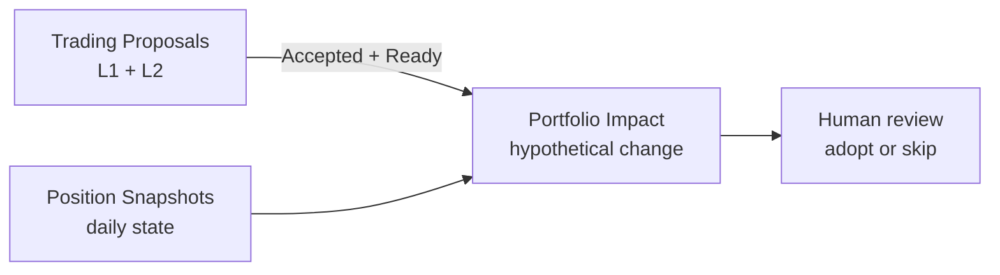

# Notion Portfolio Database Schema v2

Snapshot date: 2026-06-07

This document defines the Notion database schema for **portfolio planning and impact analysis**. It supports daily portfolio state capture and hypothetical “what-if” analysis when adopting a trading proposal.

It does **not** define trade execution logging, cash event ledgers, cost-basis tracking, or P&L accounting.

Related research schema:

- [`data/notion/research.md`](research.md) — `Trading Proposals` (Layer 1 + Layer 2 price plan)

## Scope

### In scope

- Daily (or periodic) portfolio state via `Position Snapshots`
- Hypothetical portfolio change when adopting an accepted, price-ready proposal via `Portfolio Impact`

### Out of scope

- Multiple accounts or account-level attribution (single portfolio only)
- Executed buy/sell records, fees, taxes, settlement, or broker fill import
- Deposit, withdrawal, dividend, or fee event ledgers
- Trade-ledger-derived open positions
- Realized / unrealized P&L, average cost, and performance attribution
- Automated order placement or post-trade reconciliation against fills
- Board-lot rounding for order submission (HK/JP lot constraints)

### Excluded from this document

- Page IDs, database IDs, data source IDs, property IDs, URLs, commands, prompts, raw rows
- Raw brokerage exports, full statements, tax documents, credentials, account secrets

## Design Notes

- **Single portfolio:** one implicit account. No `Accounts` database.
- Target storage: Notion databases.
- Use Notion `number` for quantities, prices, and money values.
- Use Notion `date` for snapshot as-of dates and impact run timestamps.
- Store `symbol`, `market`, `asset_type`, and `currency` inline on snapshot rows.
- Keep instrument normalization out of scope. Add a separate instruments database only if cross-market normalization becomes difficult inline.
- **Pricing levels** (entry, stop, target) live on `Trading Proposals` only.
- **Impact outputs** (hypothetical quantity, weight, risk at stop) live on `Portfolio Impact` only.
- **Portfolio ground truth** is the latest approved `Position Snapshots` set (by `Snapshot Date`), not a derived trade ledger.
- Do not store credentials, API keys, full account numbers, raw brokerage exports, tax documents, or full statements.
- Do not apply Notion portfolio database structure changes without summarizing intended changes and receiving explicit confirmation.

## Position Snapshots

Purpose: **daily (or periodic) portfolio state capture**. Each row is one holding line or one cash line as of a snapshot date. This is the canonical input for portfolio-impact analysis.

There is no separate trade or cash-movement ledger. Updates to the portfolio are reflected by submitting a new snapshot set for a given `Snapshot Date`.

### Row model

- **Holdings:** one row per `(Snapshot Date, Symbol)` with `Asset Type` ≠ `cash`.
- **Cash:** one row per `Snapshot Date` with `Asset Type` = `cash` and `Symbol` = `CASH` (or base-currency label).

### Properties

| Property | Type | Notes |
| --- | --- | --- |
| `Snapshot` | title | Human-readable label, typically `<symbol> <snapshot_date>` or `CASH <snapshot_date>`. |
| `Snapshot Date` | date | As-of date for this portfolio state (date only; no intraday precision required). |
| `Symbol` | rich_text | Tradable symbol, or `CASH` for cash lines. |
| `Market` | select | Options: `HK`, `JP`, `US`, `OTHER`. Use `OTHER` for cash lines when needed. |
| `Asset Type` | select | Options: `equity`, `etf`, `bond`, `future`, `option`, `crypto`, `cash`, `other`. |
| `Currency` | select | Quote or reporting currency for this line. Options: `HKD`, `USD`, `JPY`, `CNY`, `OTHER`. |
| `Quantity` | number | Units held. For cash lines, store cash balance. |
| `Market Price` | number | Mark price at snapshot time. Leave empty for cash lines. |
| `Market Value` | number | `Quantity × Market Price` for holdings; for cash lines, equals `Quantity`. |
| `Source` | rich_text | Capture source label, e.g. `manual`, `broker_export`, `api`. |
| `Notes` | rich_text | Optional snapshot notes. |

### Derived values (not stored)

- **Portfolio NAV at snapshot:** sum of `Market Value` for all rows sharing the same `Snapshot Date`.
- **Position weight:** row `Market Value` ÷ portfolio NAV at the same snapshot date.
- **Latest portfolio state:** newest `Snapshot Date` (workflow convention; not a stored property).

## Portfolio Impact

Purpose: **Layer 3 hypothetical portfolio change**. Combines an accepted, price-ready `Trading Proposals` row with a snapshot-derived portfolio state to answer: *If this proposal were adopted, how would the portfolio change?*

This database stores impact outputs only. It does not record executions, fills, or post-trade adjustments.

| Property | Type | Notes |
| --- | --- | --- |
| `Impact` | title | Human-readable label, typically `<ticker> impact <impact_as_of>`. |
| `Proposal` | relation | Relation to Trading Proposals. |
| `Impact As Of` | date | Timestamp when the impact run was computed. |
| `Snapshot Date` | date | `Snapshot Date` of the portfolio state used as input. |
| `Portfolio NAV` | number | Portfolio NAV at `Snapshot Date` (sum of snapshot `Market Value`). |
| `Cash Available` | number | Cash balance from the cash snapshot row at `Snapshot Date`. |
| `Entry Price` | number | Copied from proposal at impact time (audit snapshot). |
| `Stop Price` | number | Copied from proposal at impact time (audit snapshot). |
| `Target Price` | number | Copied from proposal at impact time (audit snapshot). |
| `Risk Budget Pct` | number | Risk budget allocated to this proposal, as % of NAV. |
| `Risk Budget Amount` | number | Risk budget in currency. |
| `Quantity` | number | Hypothetical quantity if the proposal were adopted at `Entry Price`. |
| `Notional` | number | Hypothetical notional at `Entry Price` (`Quantity × Entry Price`). |
| `Portfolio Weight Pct` | number | Hypothetical position weight after adoption (% of NAV). |
| `Max Loss At Stop` | number | Estimated loss if stop is hit at hypothetical `Quantity`. |
| `Weight Before Pct` | number | Existing weight for the same symbol before adoption, if any. 0 if new line. |
| `Weight After Pct` | number | Combined weight after hypothetical adoption. |
| `Impact Status` | select | Options: `ready`, `rejected`, `stale`. |
| `Rejection Reason` | rich_text | Why impact was rejected (e.g. insufficient cash, duplicate exposure, risk cap). |
| `Notes` | rich_text | Optional impact notes. |

### Portfolio Impact Relations

- `Portfolio Impact.Proposal` → `Trading Proposals`

### Optional mirror on Trading Proposals (workflow)

If useful for Notion views, add on `Trading Proposals`:

- `Impact Status` (select): summary mirror — `Not Started`, `Ready`, `Rejected`, `Stale`
- Relation rollup from `Portfolio Impact` is an alternative to a manual mirror field.

Canonical impact outputs remain on `Portfolio Impact` only.

## Cross-Database Flow

Canonical proposal schema: [`data/notion/research.md`](research.md) (Trading Proposals section).

1. Research follow-up imports Layer 1 fields into `Trading Proposals`.
2. Alpha Vantage last close updates `Last Price` and `Quote As Of`.
3. External price plan (Pine Screener CSV) populates `Entry Price`, `Stop Price`, `Target Price`, and `Reward Risk Ratio`; sets `Pricing Status = Ready` when applicable.
4. User captures or imports daily `Position Snapshots`.
5. Portfolio impact run creates one `Portfolio Impact` row per proposal when preconditions are met.
6. User reviews impact outputs and decides whether to adopt the proposal outside this workspace (manual execution elsewhere).

There is no trade-logging step in this workspace.

## Portfolio Impact Preconditions

A portfolio impact run requires all of the following:

| Requirement | Source |
| --- | --- |
| Human approval | `Trading Proposals.Status` = `Accepted` |
| Pricing complete | `Trading Proposals.Pricing Status` = `Ready` |
| Trade intent | `Trading Proposals.Intent` = `Trade` (exclude pure `Watchlist`) |
| Entry level | `Trading Proposals.Entry Price` populated |
| Stop level | `Trading Proposals.Stop Price` populated |
| Target level | `Trading Proposals.Target Price` populated |
| Portfolio inputs | Latest approved `Position Snapshots` |

At impact time, copy `Entry Price`, `Stop Price`, and `Target Price` from the proposal onto the `Portfolio Impact` row as an audit snapshot. Do not re-derive pricing on the impact row.

After a successful run:

- Create or update `Portfolio Impact` with `Impact Status` = `ready`.
- Optionally mirror summary status on the linked proposal (`Impact Status` = `Ready`).

Mark `Impact Status` = `stale` when:

- A newer `Snapshot Date` exists, or
- Linked proposal `Pricing Status` becomes `Stale` or pricing fields change materially.

## Reconstruction Order

1. Create database `Position Snapshots`; add properties listed above.
2. Create database `Portfolio Impact`; add non-relation properties; add `Proposal` relation.
3. Ensure `Trading Proposals` exists per [`research.md`](research.md).
4. Optionally add proposal-level `Impact Status` mirror field after impact workflow stabilizes.
