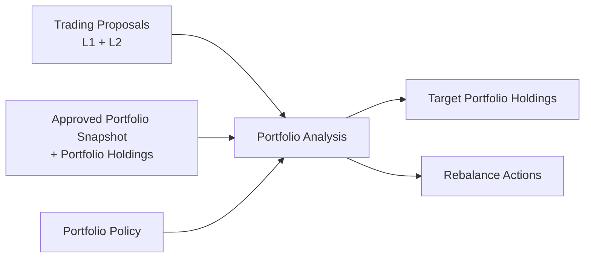

# Notion Portfolio Database Schema v2

Snapshot date: 2026-06-07

This document defines the Notion database schema for **portfolio planning**. It supports daily portfolio state capture and **Portfolio Analysis** outputs. Layer 3 output schemas (`Portfolio Analysis`, `Target Portfolio Holdings`, `Rebalance Actions`) are conceptual here; field-level detail is TBD.

It does **not** define trade execution logging, cash event ledgers, or P&L accounting trails.

Related:

- [`data/notion/research.md`](research.md) — `Trading Proposals` (Layer 1 + Layer 2 price plan)
- [`../portfolio/guardrails.md`](../portfolio/guardrails.md) — `Portfolio Policy` and analysis guardrails

## Scope

### In scope

- Daily (or periodic) portfolio state via `Portfolio Snapshot` and `Portfolio Holdings`
- **Portfolio Analysis** → **Target Portfolio Holdings** + **Rebalance Actions** (Layer 3; workflow ends at these outputs)

### Out of scope

- Multi-broker or sub-portfolio attribution (single portfolio only)
- Executed buy/sell records, fees, taxes, settlement, or broker fill import
- Deposit, withdrawal, dividend, or fee event ledgers
- Trade-ledger-derived open positions
- Realized / unrealized P&L and performance attribution trails
- Trade-ledger-derived average cost history (`Portfolio Holdings` may store point-in-time `Average Cost` from broker capture only)
- Tracking whether rebalance actions were executed (inferred only when a later `Portfolio Snapshot` is submitted)
- Automated order placement or post-trade reconciliation against fills
- Board-lot rounding for order submission (HK/JP lot constraints)

### Excluded from this document

- Page IDs, database IDs, data source IDs, property IDs, URLs, commands, prompts, raw rows
- Raw brokerage exports, full statements, tax documents, credentials, account secrets

## Design Notes

- **Single portfolio:** no multi-broker or sub-portfolio attribution.
- **Approved Portfolio Snapshot:** a `Portfolio Snapshot` row with `Status` = `approved`. The planner uses the latest by `Snapshot Date`.
- Target storage: Notion databases.
- Use Notion `number` for quantities, prices, and money values.
- Use Notion `date` for snapshot as-of dates and analysis timestamps.
- Store `ticker`, `market`, `asset_class`, and `currency` on `Portfolio Holdings`.
- **Planned prices** (entry, stop, target) on holdings support risk-at-stop; canonical plan for new ideas remains on `Trading Proposals`.
- **`Average Cost`** on a holding is actual cost at capture time (broker/manual), not a computed ledger.
- **Layer 3 deliverables:** `Portfolio Analysis` produces `Target Portfolio Holdings` and `Rebalance Actions`. The workspace workflow **ends** there.
- **Portfolio ground truth** is the latest **Approved Portfolio Snapshot** and its `Portfolio Holdings`, not a derived trade ledger.
- **Portfolio heat** and exposure aggregates are computed by the analyzer at run time; not stored on `Portfolio Snapshot`.
- Do not store credentials, API keys, full account numbers, raw brokerage exports, tax documents, or full statements.
- Do not apply Notion portfolio database structure changes without summarizing intended changes and receiving explicit confirmation.

## Portfolio Snapshot

Purpose: **one portfolio state as of a `Snapshot Date`**. One row per snapshot date. When `Status` = `approved`, this row is an **Approved Portfolio Snapshot** and may be used as input to **Portfolio Analysis**.

There is no separate trade or cash-movement ledger. A new portfolio state is captured by creating a new `Portfolio Snapshot` for a given date.

### Properties

| Property | Type | Notes |
| --- | --- | --- |
| `Snapshot` | title | Human-readable label, typically `Portfolio YYYY-MM-DD`. |
| `Snapshot Date` | date | As-of date (date only). |
| `Status` | select | `draft`, `approved`, `superseded`. Latest `approved` = input to analysis. |
| `Base Currency` | select | `HKD`, `USD`, `JPY`, `CNY`, `OTHER`. Align with [`guardrails.yaml`](../portfolio/guardrails.yaml). |
| `Captured At` | date | When recorded (datetime optional). |
| `Portfolio NAV` | number | Sum of holdings `Market Value`; rollup or manual check. |
| `Cash Available` | number | CASH holding `Market Value`. |
| `Holdings Count` | number | Non-cash holdings count; optional rollup. |
| `Source` | rich_text | e.g. `manual`, `broker_export`, `api`. |
| `Notes` | rich_text | Optional notes. |

### Portfolio Snapshot Relations

- `Portfolio Holdings` → holding rows (relation on holdings)

### Derived values (analyzer; not stored)

- **Portfolio heat pct:** Σ holding risk-at-stop ÷ NAV (see **Portfolio Holdings**).
- **Market exposure pct:** sum of weights by `Market`.
- **Latest Approved Portfolio Snapshot:** max `Snapshot Date` where `Status` = `approved`.

## Portfolio Holdings

Purpose: **one row per holding or cash** within a `Portfolio Snapshot`. Input for **Portfolio Analysis** and risk-at-stop.

### Row model

- **Holdings:** one row per `(Portfolio Snapshot, Ticker)` with `Holding Type` = `holding`.
- **Cash:** one row per snapshot with `Holding Type` = `cash`, `Ticker` = `CASH`.
- **Short support:** `Trade Type` = `short`; risk-at-stop uses stop above entry.

### Identity and quantity

| Property | Type | Notes |
| --- | --- | --- |
| `Holding` | title | Ticker only (e.g. `NVDA`, `0700`) or `CASH`. Snapshot context comes from `Portfolio Snapshot` relation and `Snapshot Date` rollup. |
| `Portfolio Snapshot` | relation | → `Portfolio Snapshot`. |
| `Snapshot Date` | rollup | Roll up `Portfolio Snapshot.Snapshot Date`. |
| `Holding Type` | select | `holding`, `cash`. |
| `Ticker` | rich_text | Aligns with `Trading Proposals.Ticker`. Cash: `CASH`. |
| `Company Name` | rich_text | Optional. |
| `Market` | select | `HK`, `JP`, `US`, `OTHER`. |
| `Asset Class` | select | `equity`, `etf`, `bond`, `future`, `option`, `crypto`, `cash`, `other`. |
| `Currency` | select | Quote or reporting currency. |
| `Trade Type` | select | `long`, `short`, `n/a`. Cash: `n/a`. |
| `Quantity` | number | Units held. Cash: balance. |
| `Market Price` | number | Mark price. Empty for cash. |
| `Market Value` | number | Holdings: `Quantity × Market Price`. Cash: = `Quantity`. |

### Planned vs actual prices

| Property | Type | Notes |
| --- | --- | --- |
| `Entry Price` | number | **Planned** entry / reference (from proposal or manual). |
| `Average Cost` | number | **Actual** cost at capture. Optional. Not a ledger. |
| `Stop Price` | number | Planned stop for risk-at-stop. |
| `Target Price` | number | Planned target. |

### Thesis and provenance

| Property | Type | Notes |
| --- | --- | --- |
| `Source Proposal` | relation | Optional → `Trading Proposals`. |
| `Rationale` | rich_text | Why held; from proposal or manual. |
| `Invalidation` | rich_text | Optional thesis-break summary. |
| `Pricing As Of` | date | Optional; for `Market Price`. |
| `Holding Source` | rich_text | Optional if snapshot `Source` is insufficient. |
| `Notes` | rich_text | Optional. |

### Portfolio Holdings Relations

- `Portfolio Holdings.Portfolio Snapshot` → `Portfolio Snapshot`
- `Portfolio Holdings.Source Proposal` → `Trading Proposals` (optional)

### Derived values (analyzer; not stored)

| Derived | Rule |
| --- | --- |
| **Weight pct** | `Market Value` ÷ snapshot NAV × 100 |
| **Risk at stop** | `long`: `Quantity × max(0, Entry − Stop)`; `short`: `Quantity × max(0, Stop − Entry)` |
| **Risk at stop pct** | risk at stop ÷ NAV × 100 |
| **Portfolio heat pct** | Σ risk at stop ÷ NAV × 100 |

Use `Entry Price` and `Stop Price` for portfolio heat. `Average Cost` is informational unless a future workflow uses it explicitly.

## Layer 3 — Portfolio Analysis (concept only)

> Field-level Notion schema **TBD**. Layer 3 jointly optimizes eligible proposals against an **Approved Portfolio Snapshot** under [`Portfolio Policy`](../portfolio/guardrails.md). **Workflow ends** when **Target Portfolio Holdings** and **Rebalance Actions** are produced.

### Inputs

- Latest **Approved Portfolio Snapshot** and its **Portfolio Holdings**
- Eligible `Trading Proposals` (`Accepted`, `Ready`, `Intent` = `Trade`, etc.)
- Active `Portfolio Policy`

### Outputs (Notion databases — TBD)

| Database | Purpose |
| --- | --- |
| **Portfolio Analysis** | One analysis: inputs, policy audit, status, summary |
| **Target Portfolio Holdings** | Recommended target portfolio (all tickers + cash + weights) |
| **Rebalance Actions** | Suggested adjustments from current holdings → target (not execution ledger) |

Whether rebalance actions are executed is **not tracked**. A later `Portfolio Snapshot` (on another date) reflects actual state if the user chooses to capture it.

See guardrail evaluation order in [`../portfolio/guardrails.md`](../portfolio/guardrails.md).

## Cross-Database Flow

Canonical proposal schema: [`research.md`](research.md) (Trading Proposals).

1. Research follow-up imports Layer 1 into `Trading Proposals`.
2. Alpha Vantage updates `Last Price` and `Quote As Of`.
3. Pine Screener CSV populates Layer 2 prices and `Pricing Status = Ready` when applicable.
4. User captures `Portfolio Snapshot` + `Portfolio Holdings`; sets `Status` = `approved` when ready.
5. **Portfolio Analysis** reads Approved Portfolio Snapshot + eligible proposals + policy → **Target Portfolio Holdings** + **Rebalance Actions**.
6. **Workflow ends.** No execution logging. A future snapshot on a new date is a separate capture cycle, not a follow-up step to step 5.

## Reconstruction Order

1. Create `Portfolio Snapshot`; add properties above.
2. Create `Portfolio Holdings`; add properties; relations to `Portfolio Snapshot` and optional `Source Proposal`.
3. Configure `Portfolio Holdings.Snapshot Date` rollup from `Portfolio Snapshot`.
4. Create `Portfolio Policy` per [`../portfolio/guardrails.md`](../portfolio/guardrails.md).
5. Ensure `Trading Proposals` exists per [`research.md`](research.md).
6. **(Later)** Add Layer 3: `Portfolio Analysis`, `Target Portfolio Holdings`, `Rebalance Actions`.
